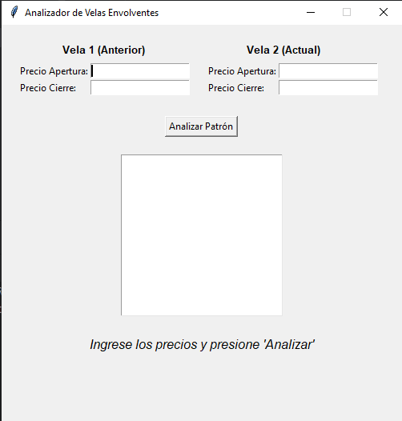
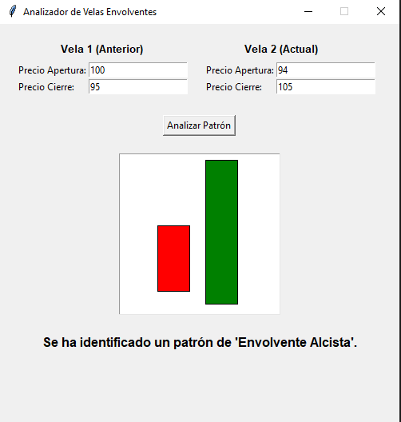
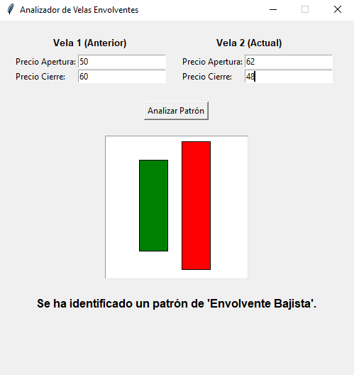
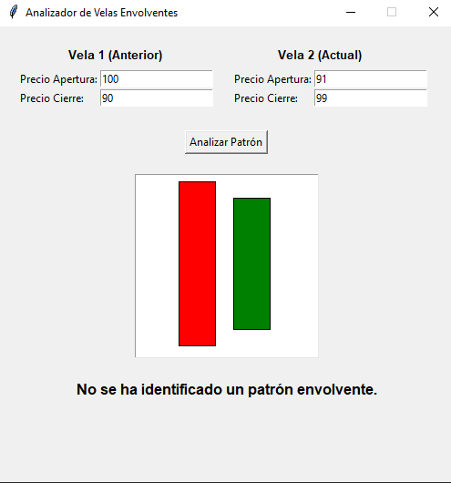

# SISTEMA EXPERTO PARA LA IDENTIFICACIÓN DE PATRONES ENVOLVENTES EN VELAS JAPONESAS

**Sebastián López Osorno, [sebastian_lopez82221@elpoli.edu.co](mailto:sebastian_lopez82221@elpoli.edu.co)**
**Juan Camilo Muñoz, [juan_munoz91202@elpoli.edu.co ](mailto:juan_munoz91202@elpoli.edu.co )**
Politécnico Colombiano Jaime Isaza Cadavid. Medellín, Colombia.

---

## 1. Introducción

Las **velas japonesas** constituyen una de las herramientas más utilizadas en el análisis técnico financiero, pues permiten visualizar de manera intuitiva el comportamiento de los precios en un intervalo de tiempo. Estas velas muestran cuatro datos fundamentales: precio de apertura, precio de cierre, precio máximo y precio mínimo. Entre los diversos patrones existentes, el **patrón envolvente (Engulfing)** es uno de los más relevantes, ya que puede anticipar cambios de tendencia en el mercado (Murphy, 1999).

El presente trabajo desarrolla un **sistema experto** que permite identificar de manera automática patrones envolventes alcistas y bajistas a partir de los precios de apertura y cierre de dos velas consecutivas. El objetivo general es brindar al usuario una herramienta de análisis que apoye la toma de decisiones en el mercado financiero, eliminando la subjetividad de la interpretación visual.

Las entradas del sistema corresponden a los precios de apertura y cierre de dos velas consecutivas. La salida del sistema es la identificación del patrón: **Envolvente Alcista**, **Envolvente Bajista** o la indicación de que no existe un patrón envolvente. El sistema se basa en reglas lógicas definidas en CLIPS, las cuales son procesadas para determinar el resultado.

---

## 2. Reglas definidas para el sistema experto

El sistema experto fue diseñado con **dos reglas principales** que permiten clasificar los patrones:

**Tabla 1. Reglas definidas para el sistema experto de velas japonesas**

| ID  | Nombre             | Descripción                                                                                                        |
| --- | ------------------ | ------------------------------------------------------------------------------------------------------------------ |
| R01 | Envolvente Bajista | Si la primera vela es alcista y la segunda es bajista que la envuelve, se identifica un patrón envolvente bajista. |
| R02 | Envolvente Alcista | Si la primera vela es bajista y la segunda es alcista que la envuelve, se identifica un patrón envolvente alcista. |

En términos generales, las reglas se agrupan en función de la **dirección de la tendencia** que pueden anticipar. Estas reglas trabajan de manera encadenada, dado que primero analizan las condiciones de apertura y cierre de cada vela y luego validan si existe una relación de envolvimiento entre ambas. El motor de inferencia de CLIPS se encarga de ejecutar estas reglas y producir el diagnóstico final.

---

## 3. Aplicación construida

La aplicación fue desarrollada en **Python**, utilizando la librería **TKinter** para la interfaz gráfica y **CLIPSPY** como puente para implementar las reglas del sistema experto. El entorno de desarrollo empleado fue **Visual Studio Code**.

En la **Figura 1** se muestra el formulario principal de la aplicación, donde el usuario puede ingresar los precios de apertura y cierre de las dos velas a analizar.

*Figura 1. Pantallazo de captura de datos del sistema experto*

El sistema experto funciona de la siguiente manera:

1. El usuario ingresa los precios de apertura y cierre de dos velas consecutivas.
2. La información es enviada al motor de inferencia de CLIPS, donde se evalúan las reglas.
3. El sistema devuelve como salida el tipo de patrón identificado, que se muestra en pantalla.
4. Además, las velas son representadas gráficamente en un **canvas** para una mejor visualización del análisis.

En la **Figura 2** se presenta un ejemplo del dibujo de las velas en la interfaz gráfica.

*Figura 2. Representación gráfica de las velas ingresadas en el sistema*

El código fuente de la aplicación se encuentra en el siguiente repositorio de GitHub:
[URL del repositorio](https://github.com/EngineeringSebastian-s/IA/edit/main/Quiz1/SistemaExperto/)

La demostración del funcionamiento:

En la **Figura 1** se muestra el formulario principal de la aplicación:

En la **Figura 2** se presenta un ejemplo del dibujo de las velas:

En la **Figura 3** otro ejemplo de salida del sistema:

Finalmente, en la **Figura 4** se observa un caso alternativo:

---

## 4. Conclusiones

El desarrollo de este sistema experto permite evidenciar las ventajas de aplicar técnicas de **inteligencia artificial simbólica** en el análisis financiero. Gracias a las reglas implementadas, se logra una clasificación objetiva de los patrones envolventes, reduciendo errores humanos en la interpretación de velas japonesas. Además, la interfaz gráfica facilita la interacción y comprensión del análisis para usuarios no expertos.

Como trabajo futuro, se plantea la ampliación del sistema experto para reconocer **otros patrones de velas japonesas** como Doji, Martillo, Estrella Fugaz, entre otros. Asimismo, sería posible integrar el sistema con fuentes de datos en tiempo real para su aplicación directa en plataformas de trading.

---

## 5. Bibliografía

Murphy, J. J. (1999). *Technical Analysis of the Financial Markets: A Comprehensive Guide to Trading Methods and Applications*. New York Institute of Finance.

Pring, M. J. (2002). *Technical Analysis Explained*. McGraw-Hill.

Giarratano, J., & Riley, G. (2005). *Expert Systems: Principles and Programming*. Thomson Learning.

¿Quieres que te prepare este documento en **formato académico (Word/PDF con figuras y tablas)** para que lo uses directamente, o lo prefieres en **texto plano como guía** para que lo armes tú?
