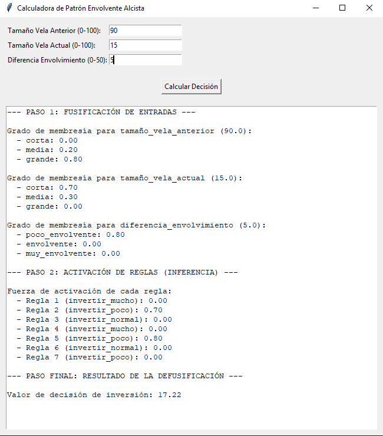
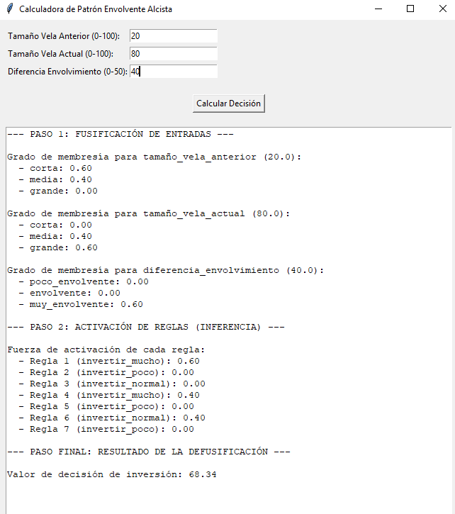
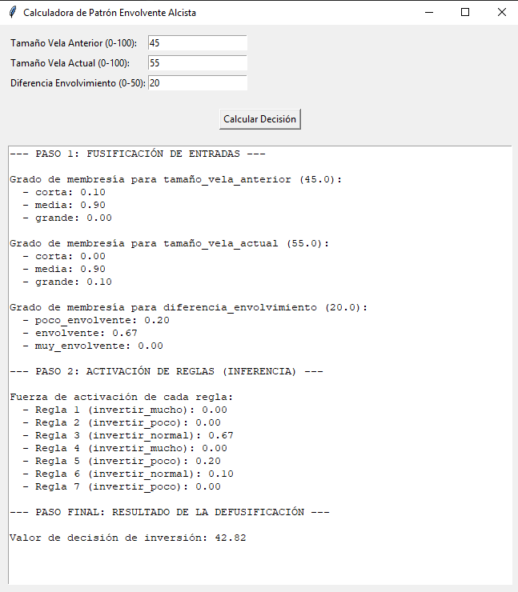

# SISTEMA DIFUSO PARA LA IDENTIFICACIÓN DE PATRONES ENVOLVENTES EN VELAS JAPONESAS

**Sebastián López Osorno, [sebastian\_lopez82221@elpoli.edu.co](mailto:sebastian_lopez82221@elpoli.edu.co)**
**Juan Camilo Muñoz, [juan\_munoz91202@elpoli.edu.co](mailto:juan_munoz91202@elpoli.edu.co)**
Politécnico Colombiano Jaime Isaza Cadavid. Medellín, Colombia.

---

## 1. Descripción general

El análisis de velas japonesas es una de las técnicas más utilizadas en los mercados financieros, ya que permite estudiar de forma visual la evolución de los precios. Entre los patrones más conocidos está el **envolvente (Engulfing)**, que puede anticipar posibles cambios de tendencia. Tradicionalmente, la detección de estos patrones depende de reglas estrictas y binarias, lo que no siempre refleja la realidad del mercado, donde las condiciones suelen ser ambiguas.

Para atender esta incertidumbre, en este trabajo se construyó un **sistema difuso** que permite identificar el nivel de decisión de inversión a partir de las características de dos velas consecutivas y la diferencia de envolvimiento. Las entradas del sistema son:

* **Tamaño de la vela anterior** (0 a 100).
* **Tamaño de la vela actual** (0 a 100).
* **Diferencia de envolvimiento** (0 a 50).

La salida del sistema es la **decisión de inversión**, la cual puede clasificarse en tres categorías: *invertir poco, invertir normal o invertir mucho*. De este modo, el modelo no se limita a una clasificación rígida, sino que utiliza valores intermedios que mejor representan la incertidumbre del mercado.

---

## 2. Conjuntos difusos definidos

En la **Figura 1** se presentan los conjuntos de entrada del sistema difuso.

* Para el **tamaño de la vela anterior** y el **tamaño de la vela actual**, se definieron tres etiquetas: *corta, media y grande*.
* Para la **diferencia de envolvimiento**, se definieron tres etiquetas: *poco envolvente, envolvente y muy envolvente*.

*Figura 1. Conjuntos difusos de entrada: tamaño de velas y diferencia de envolvimiento*

En la **Figura 2** se presenta el conjunto difuso de salida, denominado **decisión de inversión**, con tres etiquetas: *invertir poco, invertir normal e invertir mucho*.

*Figura 2. Conjunto difuso de salida: decisión de inversión*

---

## 3. Reglas Difusas

El sistema difuso se fundamenta en un conjunto de **siete reglas** que relacionan los tamaños de las velas y la diferencia de envolvimiento con el nivel de inversión recomendado.

**Tabla 1. Reglas definidas para el sistema difuso de velas japonesas**

| ID  | Regla                                                                                      | Descripción |
| --- | ------------------------------------------------------------------------------------------ | ----------- |
| R01 | Si tamaño vela anterior corta y actual grande y diferencia muy envolvente → invertir mucho |             |
| R02 | Si tamaño vela actual corta → invertir poco                                                |             |
| R03 | Si ambas velas son medias y diferencia envolvente → invertir normal                        |             |
| R04 | Si tamaño vela actual media y diferencia muy envolvente → invertir mucho                   |             |
| R05 | Si diferencia poco envolvente → invertir poco                                              |             |
| R06 | Si tamaño vela anterior corta y actual media → invertir normal                             |             |
| R07 | Si ambas velas son grandes y diferencia poco envolvente → invertir poco                    |             |

---

## 4. Aplicación construida

La aplicación fue desarrollada en **Python**, utilizando la librería **Tkinter** para la interfaz gráfica y la librería **Scikit-Fuzzy (skfuzzy)** para la implementación de los conjuntos y reglas difusas. El entorno de desarrollo empleado fue **Visual Studio Code**.

En la **Figura 3** se muestra el formulario principal de la aplicación, donde el usuario puede ingresar los valores de tamaño de las velas y la diferencia de envolvimiento.

*Figura 3. Pantallazo del sistema difuso de decisión de inversión*

El funcionamiento del sistema es el siguiente:

1. El usuario ingresa los valores de las tres entradas.
2. El motor difuso realiza el proceso de **fusificación**, activación de reglas e inferencia.
3. Se ejecuta la **defusificación**, obteniendo un valor final de decisión de inversión.
4. Los resultados se muestran en un área de texto junto con los grados de pertenencia y fuerza de activación de cada regla.
5. Se despliega un gráfico de la decisión final para visualizar el comportamiento del sistema.

El código fuente de la aplicación se encuentra en el siguiente repositorio de GitHub:
[URL del repositorio](https://github.com/EngineeringSebastian-s/IA/edit/main/Quiz1/LogicaDifusa)

La demostración del funcionamiento:

En la **Figura 1** se muestra el formulario principal de la aplicación:

En la **Figura 2** se presenta un ejemplo de las decisiones basado en la logica difusa:

En la **Figura 3** otro ejemplo  de las decisiones basado en la logica difusa

Finalmente, en la **Figura 4** se observa un caso de las decisiones basado en la logica difusa:

---

## 5. Conclusiones

El sistema difuso desarrollado permite **modelar la incertidumbre en el análisis de patrones envolventes**, proporcionando resultados más flexibles que los obtenidos con reglas rígidas. Al utilizar conjuntos lingüísticos como *corta, media, grande* o *envolvente*, se logra una representación más realista de los datos del mercado.

Este enfoque evidencia la fortaleza de los **sistemas de lógica difusa** en la toma de decisiones financieras, pues admiten niveles intermedios de pertenencia y no solo clasificaciones binarias. Como trabajo futuro, se plantea la incorporación de otros indicadores técnicos, como volumen de negociación o medias móviles, así como la integración con datos en tiempo real para ofrecer un sistema de apoyo al trading automatizado.

---

## 6. Bibliografía

Ross, T. J. (2010). *Fuzzy Logic with Engineering Applications*. Wiley.

Zadeh, L. A. (1965). *Fuzzy sets*. Information and Control, 8(3), 338–353.

Giarratano, J., & Riley, G. (2005). *Expert Systems: Principles and Programming*. Thomson Learning.

¿Quieres que te lo prepare directamente en **Word/PDF con espacio para las figuras y tablas** (como el anterior), o lo dejas en **texto plano para que lo copies**?

