# TALLER ALGORITMOS GENÉTICOS

**Sebastián López Osorno, [sebastian\_lopez82221@elpoli.edu.co](mailto:sebastian_lopez82221@elpoli.edu.co)**
**Juan Camilo Muñoz, [juan\_munoz91202@elpoli.edu.co](mailto:juan_munoz91202@elpoli.edu.co)**

Politécnico Colombiano Jaime Isaza Cadavid. Medellín, Colombia.

---

## 1. Algoritmo genético para Image Colorization


### 1.1 Descripción general

El problema abordado consiste en reconstruir o estimar una versión a color de una imagen dada únicamente su versión en escala de grises. La entrada del sistema es una imagen RGB objetivo que se convierte a una matriz de píxeles; esa misma imagen se transforma con la conversión NTSC (luminancia) para obtener la versión en gris que actúa como restricción/guía. El reto es generar, mediante búsqueda estocástica (algoritmo genético), imágenes RGB cuya luminancia se aproximen a la imagen gris objetivo y, adicionalmente, cuyos valores RGB se acerquen al objetivo cuando éste está disponible. El objetivo del algoritmo es encontrar arreglos de píxeles (imágenes) que optimicen simultáneamente la semejanza en luminancia y la similitud RGB.


El enfoque propuesto modela cada individuo como una imagen completa (matriz h×w×3). A partir de una población inicial generada perturbando la luminancia objetivo con ruido, se aplica selección por torneo, cruce uniforme y un conjunto diverso de operadores de mutación (ruido pequeño/grande, intercambio de píxeles, inversión de parches, desplazamiento de canales, etc.). Se registra la evolución del mejor fitness a través de las generaciones y se guardan snapshots (imágenes) en generaciones seleccionadas. Para documentar comportamiento y robustez se ejecutaron múltiples experimentos y se guardaron resultados en la carpeta `results` (iniciales, generaciones intermedias, gráficas y resultado final).

### 1.2 Conversión de RGB a escala de grises

Una imagen en color está definida por sus tres componentes: rojo (R), verde (G) y azul (B). Cada canal es una matriz bidimensional de valores (0–255). En conjunto conforman una matriz tridimensional \(h \times w \times 3\).  
En contraste, una imagen en escala de grises es una matriz \(h \times w\), donde cada píxel representa la intensidad de luminancia percibida.


### Métodos de conversión

#### 1.2.1. Promedio simple
El método más básico calcula el promedio aritmético de los tres canales:
\[
Y = \frac{R + G + B}{3}
\]

Ejemplo en Python:
```python
grayscale_average_img = np.mean(fix_img, axis=2)
plt.imshow(grayscale_average_img, cmap='gray')
plt.savefig('image_average_method.png')
````


---

#### 1.2.2. Promedio ponderado (NTSC / ITU-R BT.601)

Usado en televisión NTSC y en OpenCV.
Se ajusta a la percepción humana: el ojo es más sensible al verde que al rojo, y al azul casi nada.

$$
Y = 0.299R + 0.587G + 0.114B
$$

Ejemplo en Python:

```python
Y = 0.299 * R + 0.587 * G + 0.114 * B
plt.imshow(Y, cmap='gray')
plt.savefig('image_weighted_average_byhand.png')
```


---

#### 1.2.3. Método de luminosidad (ITU-R BT.709)

Más sofisticado, usado en estándares modernos (HD/4K):

$$
Y = 0.2126R + 0.7152G + 0.0722B
$$

Ejemplo en Python:

```python
Z = 0.2126 * R + 0.7152 * G + 0.0722 * B
plt.imshow(Z, cmap='gray')
plt.savefig('image_luminosity_method.png')
```


### 1.3 Función objetivo

La función objetivo combina dos componentes: (1) la diferencia absoluta total en los tres canales RGB entre un individuo y la imagen objetivo RGB (cuando esta exista), y (2) la diferencia absoluta total entre la luminancia (conversión NTSC) del individuo y la luminancia objetivo (grayscale). Se pesa cada componente mediante factores `alpha` (para RGB) y `beta` (para luminancia). Finalmente se transforma el error a una medida de fitness creciente:

**Ecuación 1:**

$$\text{error}_{total} = \alpha \sum_{p} |RGB_{ind}(p) - RGB_{target}(p)| + \beta \sum_{p} |Y_{ind}(p) - Y_{target}(p)|$$

$$\text{fitness} = \dfrac{1}{1 + \text{error}_{total}}$$

Donde \$$Y\$$ es la luminancia NTSC: \$$Y = 0.299 R + 0.587 G + 0.114 B\$$ y la suma se realiza sobre todos los píxeles p.

### 1.4 Definición de población

La población está compuesta por N individuos, cada uno representado por una matriz de tamaño `h × w × 3` (canales R,G,B). La inicialización toma la luminancia objetivo y crea imágenes base replicando esa luminancia en los tres canales, luego añade ruido gaussiano (media 0, desviación típica configurable) para generar diversidad inicial. Se almacenan todas las imágenes en memoria como arrays `float32` durante la ejecución del GA.

### 1.5 Definición del cromosoma

El cromosoma es una codificación directa: cada gen corresponde al valor de color de un píxel en uno de los canales. Es decir, el cromosoma es exactamente la matriz `h × w × 3` (o su versión linealizada de longitud `h*w*3`). Esta representación real-valued facilita aplicar operadores de cruces y mutaciones que actúan directamente sobre valores RGB (ruido, desplazamientos de canal, escalado de canales, etc.).

**Figura 1.** Cromosoma definido (representación conceptual):

```
Cromosoma (individuo): [ [ [R,G,B], [R,G,B], ... ],  # fila 0
                         [ [R,G,B], [R,G,B], ... ],  # fila 1
                         ... ]
```

### 1.6 Estrategia de cruce y mutación

**Cruce.** Se utiliza un cruce uniforme a nivel píxel: se genera una máscara binaria de la dimensión `h × w` con probabilidad 0.5, y para cada posición se selecciona el píxel proveniente del padre A o del padre B según la máscara. Este cruce produce dos hijos complementarios y preserva patrones locales cuando la máscara tiene regiones contiguas aleatorias. La probabilidad de aplicar cruce entre dos padres está dada por `CROSSOVER_RATE`.

**Mutación.** Se implementó una rica batería de operadores de mutación (se eligió aleatoriamente uno cuando un individuo va a mutar). Entre ellos:

* `mutate_small_noise`: añade ruido Gaussiano de baja varianza (ajusta detalles finos).
* `mutate_large_noise`: añade ruido Gaussiano de mayor varianza (exploración global).
* `mutate_channel_shift`: desplaza todo un canal (R/G/B) por un valor entero (cambia balance de color).
* `mutate_pixel_swap`: intercambia dos píxeles aleatorios (reorganiza contenido).
* `mutate_invert_patch`: invierte (255 - valor) un parche rectangular (cambia drásticamente una región).
* `mutate_random_reset`: resetea n píxeles a colores aleatorios (introduce nuevas soluciones).
* `mutate_neighbor_average`: remplaza un píxel por el promedio de sus vecinos (suaviza).
* `mutate_scale_channels`: escala cada canal por factores cercanos a 1 (ajuste global de intensidad).
* `mutate_towards_gray`: modifica píxeles en la dirección que iguala la luminancia objetivo (mejora consistencia con la guía en gris).
* `mutate_clamp_and_jitter`: recorta valores al rango \[0,255] y aplica pequeños jitter a píxeles aleatorios.

La tasa de mutación por individuo es `MUTATION_RATE`. Además se aplica **elitismo** (los `ELITISM` mejores individuos pasan directo a la siguiente generación) y se incluye un mecanismo de **reinicio parcial** cada `RESTART_INTERVAL` generaciones para evitar estancamiento: se re-inicializa un porcentaje de la población con ruido aleatorio.

### 1.7 Aplicación construida

La implementación está escrita en **Python** y usa las bibliotecas principales: `numpy` para representación y cálculo matricial, `Pillow (PIL)` para carga y redimensión de imágenes, `matplotlib` para visualización y gráficas de evolución, y utilidades estándar (`os`, `random`, `copy`). El script produce gráficos de la evolución del mejor fitness, snapshots de generaciones seleccionadas y guarda imágenes de interés en la carpeta `results/` junto a un `README` que documenta cada ejecución.

**Figura 2.** Ejemplos de resultados guardados (en el repo local `results/`):

* `results/natural-picture-init.jpg`
* `results/natural-picture-generations.jpg`
* `results/natural-picture-result.jpg`

También hay experimentos con imágenes píxel-art, donuts, iconos y colecciones de imágenes aleatorias (archivos listados en `results/`).

### 1.8 Conclusiones

1. Los algoritmos genéticos con representación directa de píxeles pueden aproximar colores plausibles respetando la luminancia objetivo; sin embargo, la convergencia a colores exactos (cuando el objetivo RGB existe) depende fuertemente del tamaño de población, diversidad de mutaciones y la presencia de operadores dirigidos (como `mutate_towards_gray`).

2. Mantener múltiples tipos de mutación (desde pequeñas perturbaciones hasta reinicios aleatorios) evita el estancamiento en óptimos locales y permite explorar soluciones visualmente distintas. El trade-off es mayor costo computacional y la necesidad de parámetros (p.ej. tasas, intervalos) finamente ajustados.

---

## 2. Algoritmo genético para Ejercicio Imagen (Pruebas y experimentos)

### 2.1 Descripción general

Esta sección documenta variantes experimentales, pruebas y configuraciones alternativas usadas para comparar comportamiento del GA en diferentes condiciones: tamaños de imagen (8×8, 16×16, 128×128), tamaños de población, tasas de mutación/cruce y diferentes semilla aleatoria. Las pruebas buscan responder preguntas como: ¿cómo escala el GA con la resolución?, ¿qué operadores son más efectivos para pixel-art vs. fotografía natural?, ¿qué configuraciones producen imágenes estables en menos generaciones?

Para cada experimento se generó: imagen inicial (población base), gráfica de evolución (fitness vs. generaciones), muestras intermedias (ej. generación 1, 10, 100, 1000) y resultado final. Todos los archivos resultantes se almacenaron en `results/`.

### 2.2 Función objetivo

Se usó la misma función objetivo descrita en la Sección 1.2. En experimentos adicionales se probaron distintas ponderaciones `alpha` y `beta` para priorizar reproducción del color (RGB) o cumplimiento de luminancia (Y) según el tipo de imagen:

* Para pixel-art se incrementó `alpha` (priorizar RGB).
* Para imágenes naturales se aumentó `beta` (mantener luminancia coherente).

### 2.3 Definición de población

La definición de población es idéntica a la previa; lo que varía entre experimentos es la magnitud de `POPULATION_SIZE`, la inicialización (más ruido vs. menos ruido), y el porcentaje reiniciado en cada `RESTART_INTERVAL`.

### 2.4 Definición del cromosoma

Mismo formato: codificación directa `h×w×3`. Para algunos experimentos se exploró una variante híbrida: representar cromosomas como paletas reducidas más un mapa índice (más eficiente para pixel-art) — aunque la implementación principal documentada usa la representación directa.

**Figura 1 (variante).** Cromosoma alterno (paleta + mapa índices):

```
Cromosoma alterno: { paleta: [k colores], mapa: h×w (índices a la paleta) }
```

### 2.5 Estrategia de cruce y mutación

Se emplearon las mismas estrategias que en la sección 1.5. Adicionalmente:

* En experimentos de pixel-art se observó que cruces que preservan bloques (más correlación espacial en la máscara) ayudan a conservar contornos definidos.
* En imágenes naturales las mutaciones de ruido pequeño y el operador `mutate_neighbor_average` mejoran la suavidad y reducen artefactos.

### 2.6 Aplicación construida

La misma aplicación en Python, ejecutada con distintas configuraciones (parámetros definidos al inicio del script). Los resultados se guardan en `results/` con nombres que indican el experimento, por ejemplo:

```
results/donut-pixel-art-init-128x128.png
results/donut-pixel-art-generations-128x128.png
results/donut-pixel-art-results-128x128.png
```

Entre los experimentos se incluyen: donuts (pixel-art), icon-beach (ícono reducido), matrices aleatorias y una imagen natural (natural-picture).

### 2.7 Conclusiones

1. Para imágenes con contornos definidos (pixel-art) es recomendable usar poblaciones más pequeñas con mutaciones que preserven o intercambien píxeles/patches y un mayor peso en la componente RGB (`alpha`). Esto acelera la aparición de paletas y formas reconocibles.

2. Para imágenes naturales conviene priorizar la coherencia de luminancia (`beta`), usar mutaciones suaves y promover diversidad global (mutaciones grandes o reinicios parciales) para escapar de óptimos locales y permitir variaciones tonales.

---

## Anexos: ejecución y contenido de `results/`

La carpeta `results/` en el proyecto contiene todos los snapshots y gráficas generadas durante las pruebas. A continuación se lista (parcialmente) el contenido relevante:

```
results/
    donut-pixel-art-generations-128x128.png
    donut-pixel-art-grafic-128x128.png
    donut-pixel-art-init-128x128.png
    donut-pixel-art-results-128x128.png
    donuts-pixel-art-geneartions-16x16.png
    donuts-pixel-art-grafic-16x16.png
    donuts-pixel-art-init-16x16.png
    donuts-pixel-art-results-16x16.png
    icon-beach-pixel-generations.jpg
    icon-beach-pixel-grafic.jpg
    icon-beach-pixel-init.jpg
    matrix-pixel-random-generations.jpg
    matrix-pixel-random-grafic.jpg
    matrix-pixel-random-init.jpg
    natural-picture-generations.jpg
    natural-picture-grafic.jpg
    natural-picture-init.jpg
    natural-picture-result.jpg
    random-images-pixel-generations (1).png
    ... (y más archivos listados en el README)
```
## Resultados documentados

Este apartado contiene un listado de las pruebas realizadas con imágenes de distinta naturaleza y resolución. Cada prueba sigue la estructura:

* **Init**: Imagen inicial generada aleatoriamente.
* **Generations**: Evolución de la imagen a través de generaciones.
* **Results**: Imagen final aproximada al objetivo.
* **Grafic**: Curva de fitness mostrando cómo fue mejorando el algoritmo.

---

### 1. Donut Pixel Art (128x128)

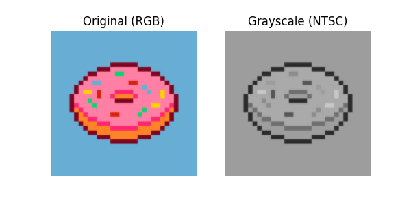  
  
  
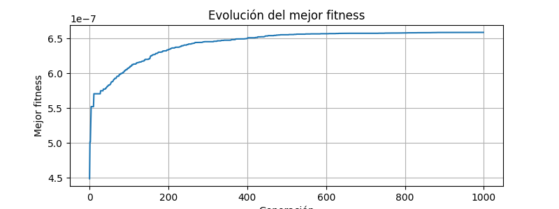  

**Enunciado de evolución:** La prueba con mayor resolución (128x128) muestra un progreso lento en las primeras generaciones debido a la complejidad de la figura, pero a partir de la generación 500 se logra una aproximación reconocible del donut, con bordes más definidos en la generación 1000.

---

### 2. Donuts Pixel Art (16x16)

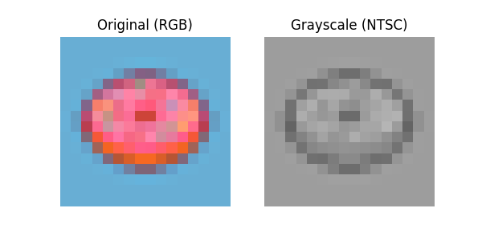  
  
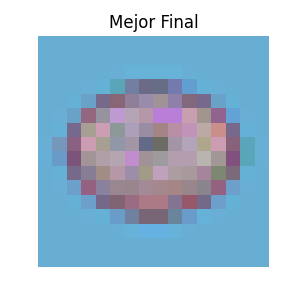  
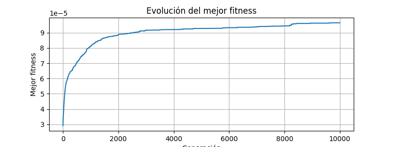  

**Enunciado de evolución:** En resolución baja (16x16), el algoritmo converge rápidamente. Hacia la generación 100 ya se observan los tonos característicos del donut, aunque con menor detalle. La curva de fitness se estabiliza pronto.

---

### 3. Icono Playa (Beach Icon)

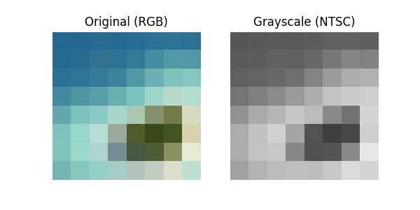  
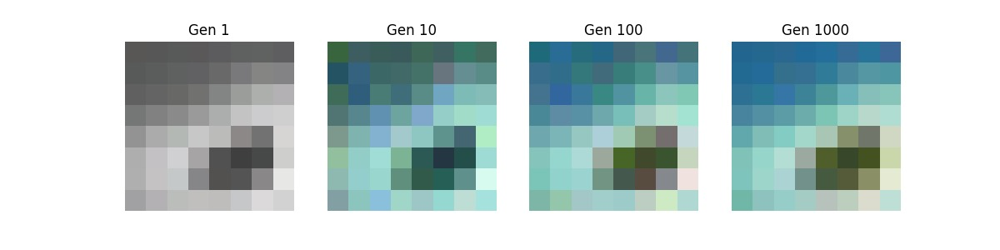  
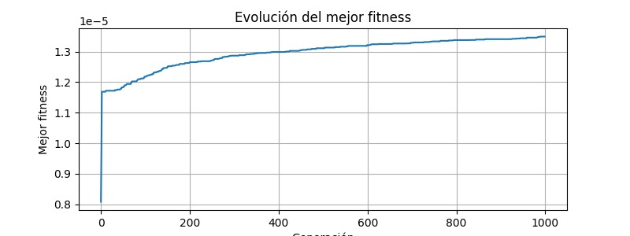  

**Enunciado de evolución:** El ícono de playa evoluciona mostrando primero parches de color azul y amarillo que luego se distribuyen en forma reconocible (cielo y arena). La convergencia ocurre antes de la generación 500.

---

### 4. Matrix Pixel Random

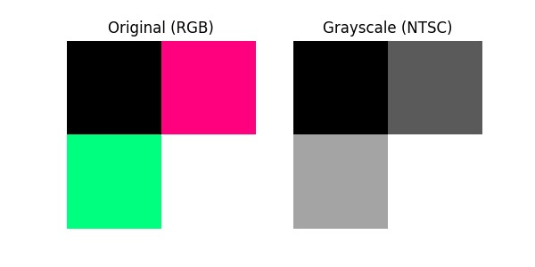  
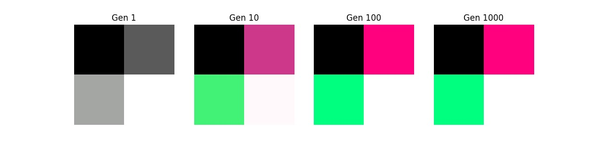  
  

**Enunciado de evolución:** La imagen de estilo "Matrix" presenta dificultad por la distribución aleatoria de caracteres verdes sobre fondo negro. El algoritmo tarda en estabilizarse, logrando mayor contraste hacia la generación 800.

---

### 5. Imagen Natural

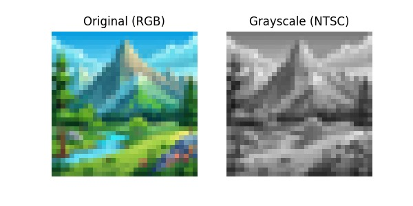  
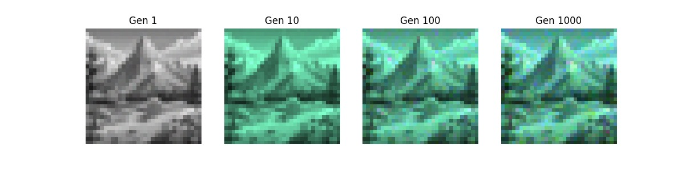  
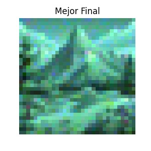  
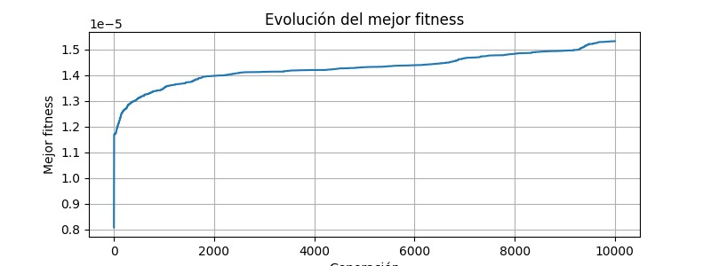  

**Enunciado de evolución:** En imágenes naturales con múltiples colores y gradientes, el algoritmo necesita más generaciones para distinguir formas. Aunque no se alcanza una nitidez perfecta, la aproximación de tonos se percibe claramente en la generación 1000.

---

### 6. Imágenes Aleatorias (7 pruebas)

Cada prueba contiene un set de imágenes iniciales, evolución, gráficas de fitness y resultados finales.

Ejemplo para la primera prueba:

  
  
  
  

...y así sucesivamente hasta la prueba (7).


