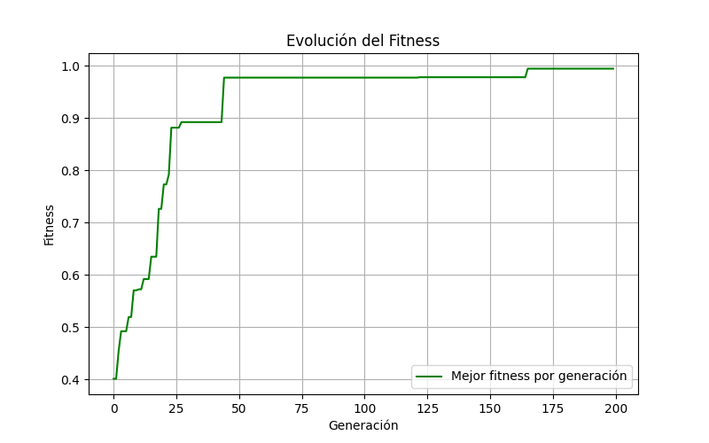
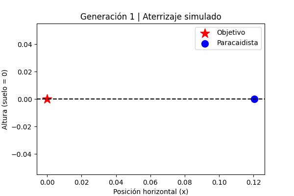
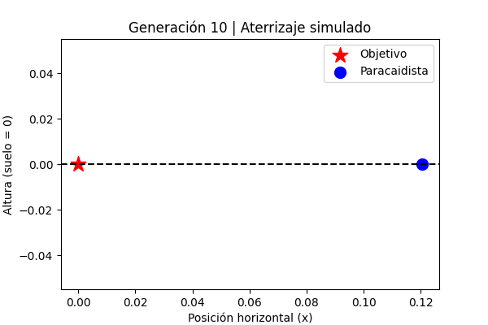
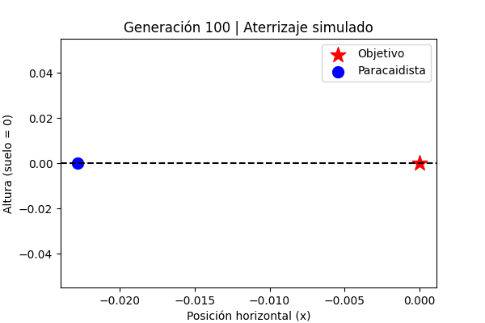
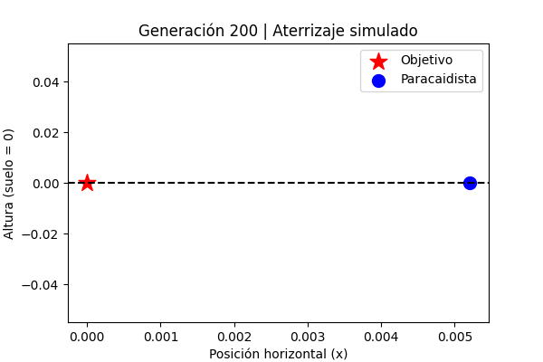

# TALLER ALGORITMOS GENÉTICOS

**Sebastián López Osorno, [sebastian\_lopez82221@elpoli.edu.co](mailto:sebastian_lopez82221@elpoli.edu.co)**
**Juan Camilo Muñoz, [juan\_munoz91202@elpoli.edu.co](mailto:juan_munoz91202@elpoli.edu.co)**

Politécnico Colombiano Jaime Isaza Cadavid. Medellín, Colombia.

---

## 1. Algoritmo genético para el Paracaidista

### 1.1 Descripción general

El problema abordado consiste en simular el aterrizaje de un paracaidista, con el objetivo de que llegue lo más cerca posible a la coordenada **x = 0** con velocidad de impacto mínima (**speed = 0**).

Cada individuo está representado por tres variables:

* **Altura de apertura del paracaídas (m)**
* **Corrección por viento (m)**
* **Ángulo de descenso (°)**

El algoritmo genético (GA) busca optimizar estos parámetros para que el aterrizaje ocurra en el punto objetivo, con un descenso seguro.

Los parámetros principales configurables son:

* `max_generations`: número máximo de generaciones.
* `population_size`: tamaño de la población.
* `tournament_size`: tamaño del torneo de selección.
* `elitism`: número de individuos que pasan intactos.
* `mutation_rate`: probabilidad de mutación.
* `crossover_rate`: probabilidad de cruce.
* `random_seed`: semilla para reproducibilidad.

---

### 1.2 Modelo de aterrizaje

El aterrizaje del paracaidista se modela de manera simplificada:

* **Posición final (landing\_x)**

$$
landing\_x = wind\_correction + descent\_angle \times 2
$$

* **Velocidad de impacto (landing\_speed)**

$$
landing\_speed = \max(0, \, 5 - \frac{opening\_altitude}{500})
$$

El **objetivo** es que $landing_x \to 0$ y $landing\_speed \to 0$.

---

### 1.3 Función objetivo (fitness)

El fitness combina error de posición y error de velocidad:

$$
error = |landing_x - TARGET_X| + |landing\_speed - TARGET\_SPEED|
$$

$$
fitness = \frac{1}{1 + error}
$$

Un fitness cercano a **1** indica un aterrizaje casi perfecto.

---

### 1.4 Representación del cromosoma

Cada cromosoma es un vector de tres genes:

```
Individuo = [opening_altitude, wind_correction, descent_angle]
```

Ejemplo:

```
[1200, -15.2, 12.5]
```

---

### 1.5 Estrategia de selección

Se aplica **selección por torneo**:

1. Se eligen `tournament_size` individuos al azar.
2. Se selecciona el de mejor fitness como padre.

Esto promueve la supervivencia de los más aptos manteniendo diversidad.

---

### 1.6 Cruce (crossover)

Se usa **cruce de un punto** con probabilidad `crossover_rate`:

Ejemplo (punto de cruce después del primer gen):

```
Padre A: [1500, -10, 20]
Padre B: [800, 25, -5]

Hijo 1:  [1500, 25, -5]
Hijo 2:  [800, -10, 20]
```

---

### 1.7 Mutación

Cada gen de un individuo puede mutar con probabilidad `mutation_rate`.
Las mutaciones son ajustes aleatorios:

* Altura: ±100 m
* Viento: ±10 m
* Ángulo: ±5°

Esto permite explorar nuevas soluciones.

---

### 1.8 Elitismo

Los `elitism` mejores individuos pasan sin cambios a la siguiente generación.
Así se asegura que no se pierda el mejor avance ya obtenido.

---

### 1.9 Aplicación construida

La implementación está escrita en **Python** y usa las bibliotecas:

* `random` → generación estocástica.
* `math` → cálculos matemáticos.
* `matplotlib` → visualización de aterrizajes y evolución del fitness.

El código permite visualizar el aterrizaje de los mejores individuos en generaciones clave (`DISPLAY_GENERATIONS`) y guardar gráficas de la evolución.

---

## 2. Experimentos y resultados

Se realizaron pruebas con:

* **Población inicial aleatoria**
* **Máximo 200 generaciones**
* **Tamaño de torneo = 3**
* **Mutation rate = 0.1**
* **Crossover rate = 0.8**
* **Elitism = 2**

### 2.1 Evolución del fitness

La siguiente gráfica muestra la mejora del fitness a lo largo de las generaciones:



### 2.2 Aterrizajes simulados

En distintas generaciones se graficó la posición final del paracaidista (azul) respecto al objetivo (estrella roja).

Ejemplo:

* **Generación 1:** aterrizajes dispersos, lejos del objetivo.
* **Generación 10:** la población converge hacia la zona central.
* **Generación 100:** varios individuos caen cerca de x=0.
* **Generación 200:** el mejor individuo alcanza casi posición perfecta.


A continuación, se muestran capturas de cómo va evolucionando la simulación en diferentes generaciones:

- **Generación 0 (población inicial):**  
  

- **Generación 1:**  
  

- **Generación 10:**  
  

- **Generación 100:**  
  

---

## 3. Conclusiones

1. El algoritmo genético es capaz de **optimizar parámetros de apertura, viento y ángulo** para lograr aterrizajes cada vez más precisos.

2. La estrategia de **elitismo + mutación controlada** asegura que el algoritmo no se estanque y mantenga un progreso estable.

3. La selección por torneo balancea explotación y exploración, evitando que el algoritmo converja prematuramente.

4. El modelo simplificado puede extenderse incluyendo más variables físicas (velocidad del viento, turbulencias, resistencia del aire), lo que aumentaría realismo y dificultad.
